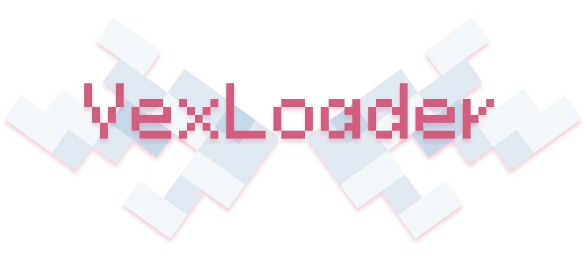

 

    <a href="https://github.com/squigglesdev/VexLoader">
        <picture>
            
        </picture>
    </a>

    
    

 

# VexLoader

Vexloader is a lightweight beginner-friendly Minecraft plugin loader designed for simplicity. 

## Installation

[Python][python_download] is required to run VexLoader. To install VexLoader, clone the repository, add any [Minecraft Server][servers] jar into the `servers` folder, and run `python start.py` in the root directory of the repository.

## Installing plugins

To install plugins, simply drag and drop the plugin python file into the `plugins` folder. VexLoader will automatically load the plugin on the next server start.

## Plugin Development

Check out the [plugin development][getting_started] guide to learn how to write plugins for VexLoader.

[python_download]: https://www.python.org/downloads/
[servers]: https://mcversions.net/
[getting_started]: GETTING_STARTED.md